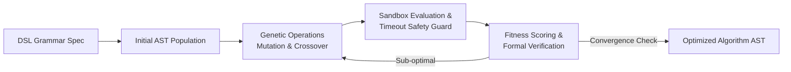
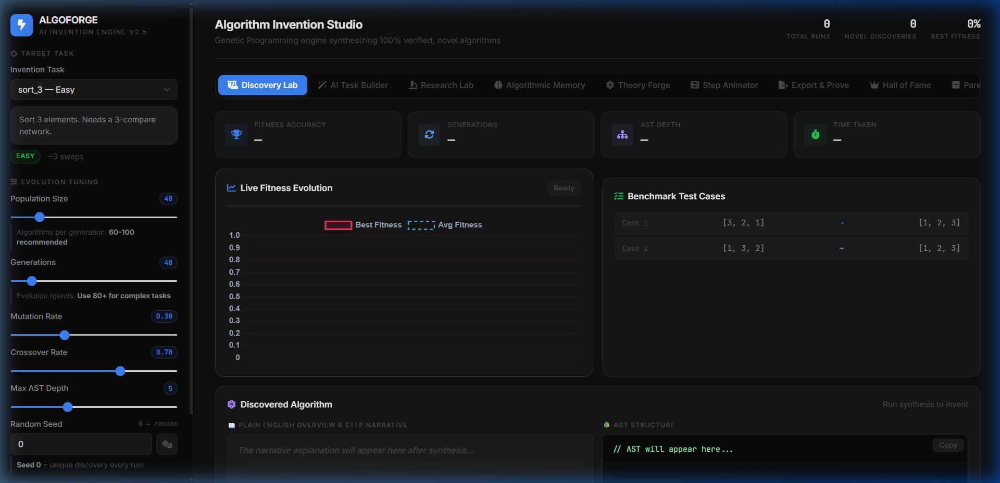
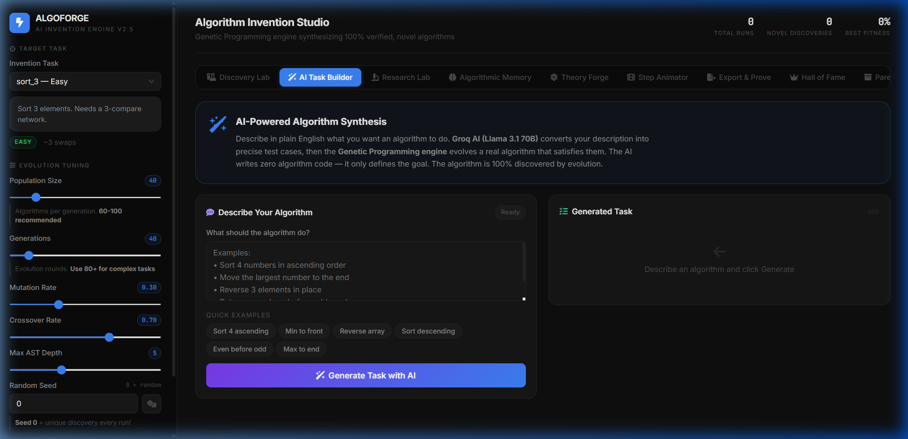
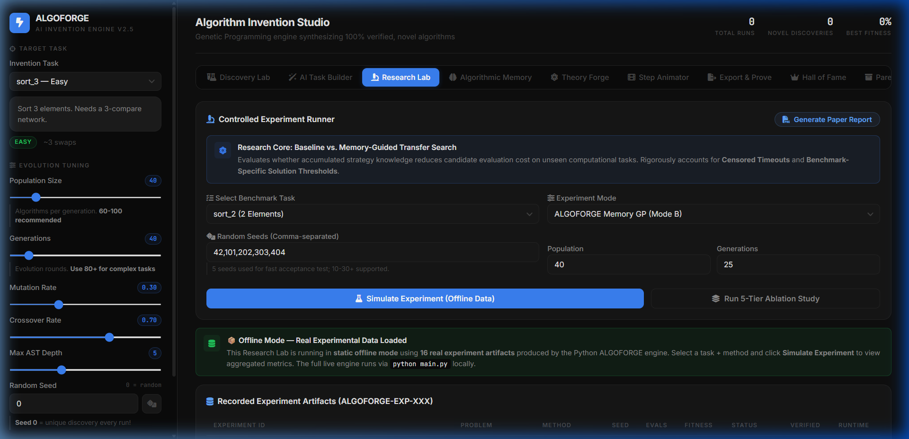
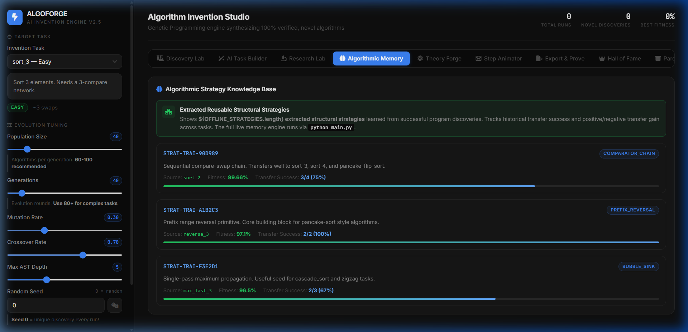
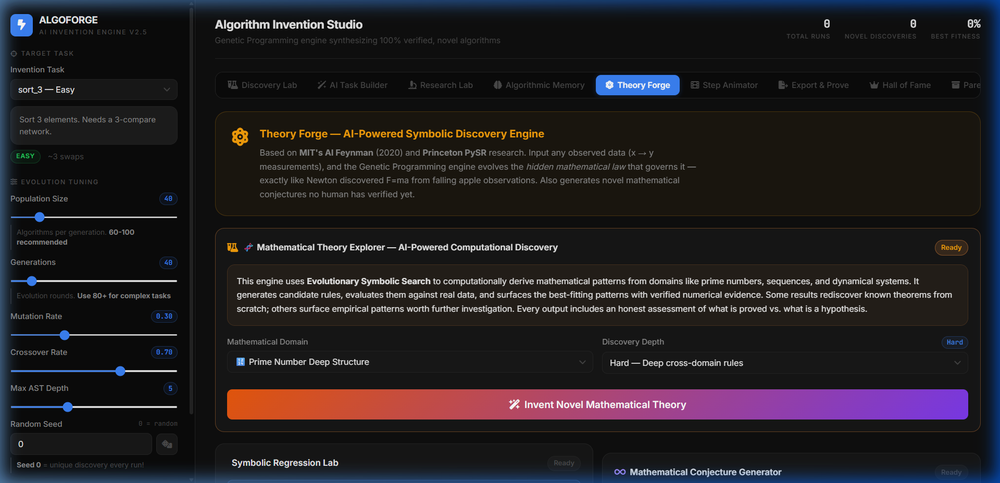
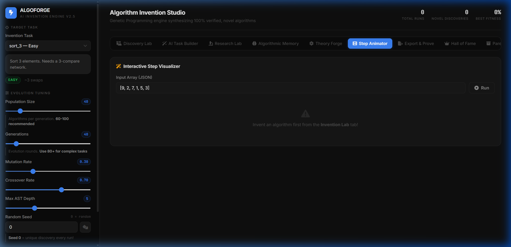
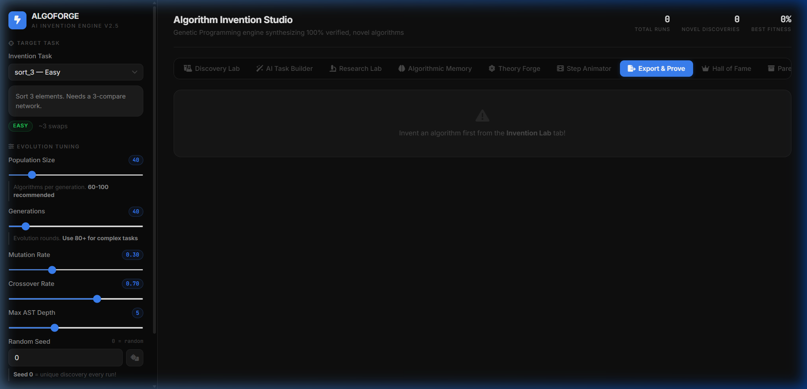

<div align="center">


# ⚡ ALGOFORGE
### Autonomous Algorithm Invention & Program Synthesis Engine

[](https://algoforgeai.netlify.app)
[](LICENSE)
[](https://www.python.org/)
[](https://nodejs.org/)
[](https://www.nature.com/articles/s41586-023-06004-9)

> **Autonomous program synthesis via Genetic Programming over AST DSLs with formal Knuth 0-1 verification, algorithmic memory transfer, and a Universal Knowledge Oracle covering Physics, CS, Math, and Engineering.**

[🚀 Launch Live Platform](https://algoforgeai.netlify.app) · [📸 Screenshots](#-visual-walkthrough) · [📊 Benchmarks](#-synthesized-examples--benchmarks) · [⚙️ System Design](#%EF%B8%8F-system-design--edge-cases-handled) · [💻 Quickstart](#-quickstart)

</div>

---

## 🧠 What is ALGOFORGE?

ALGOFORGE is a **program synthesis research platform** that treats algorithm design as a discrete combinatorial search problem. Instead of writing algorithms by hand, it:

1. Generates a population of random programs encoded as **Abstract Syntax Trees (ASTs)**
2. Evaluates each program in a **sandboxed interpreter** with strict step-bounding
3. Selects, crossovers, and mutates candidates via **multi-objective Genetic Programming**
4. Verifies discovered algorithms using **Knuth's 0-1 Sorting Lemma** (exhaustive binary vector testing)
5. Transfers learned **algorithmic subroutines** to unseen tasks via a SQLite-backed memory system

This is architecturally parallel to **DeepMind AlphaDev** (*Nature, 2023*) — the same principle of discrete program-space search — but running entirely in the browser at zero cloud cost.

---

## 🔁 Synthesis Pipeline Architecture



### Full Engine Data Flow

```
┌─────────────────────────────────────────────────────────────────────────────────┐
│                         ALGOFORGE SYNTHESIS PIPELINE                            │
└─────────────────────────────────────────────────────────────────────────────────┘

 ┌──────────────────┐     ┌──────────────────────────────────────────────────────┐
 │ Algorithmic      │────>│           GENETIC SEARCH ENGINE                       │
 │ Memory (SQLite)  │  ↑  │  Population: 20–150 AST programs                     │
 │ Strategy Library │  │  │  ┌─────────────┐  ┌────────────┐  ┌──────────────┐  │
 │ Subtree Archive  │  │  │  │ Tournament  │  │ Subtree    │  │ Point Mut.   │  │
 └──────────────────┘  │  │  │ Selection   │→ │ Crossover  │→ │ & Elitism   │  │
           ↑           │  │  └─────────────┘  └────────────┘  └──────────────┘  │
     Strategy          │  └─────────────────────────────────────────────────────┘
     Extraction        │                            │
           │           │                            ▼
 ┌─────────────────┐   │   ┌──────────────────────────────────────────────────────┐
 │  Solved Program │   │   │            SANDBOXED AST INTERPRETER                 │
 │  Archive        │   │   │  • Step-bounded execution (max 500 ops)              │
 └─────────────────┘   │   │  • Out-of-bounds array access protection             │
                        │   │  • Frame-by-frame register snapshot recording        │
                        │   │  • Infinite loop detection via step counter          │
                        │   └─────────────────────────┬────────────────────────────┘
                        │                             │
                        │                             ▼
                        │   ┌──────────────────────────────────────────────────────┐
                        │   │           MULTI-OBJECTIVE FITNESS SCORER             │
                        │   │  score = accuracy − step_penalty − depth_penalty    │
                        │   │  Pareto front: Correctness × Simplicity × Speed     │
                        │   └─────────────────────────┬────────────────────────────┘
                        │                             │  (if fitness ≥ 95%)
                        │                             ▼
                        │   ┌──────────────────────────────────────────────────────┐
                        │   │       FORMAL VERIFICATION (Knuth 0-1 Principle)      │
                        │   │  Test all 2ⁿ binary vectors exhaustively             │
                        │   │  ∀ x⃗ ∈ {0,1}ᴺ → f(x⃗) sorted  ⟹  ∀ y⃗ ∈ ℝᴺ sorted  │
                        └───│  Pass = Mathematical correctness certificate          │
                            └──────────────────────────────────────────────────────┘
```

---

## ✨ Key Capabilities

| Capability | Technical Detail |
|:---|:---|
| **AST Domain-Specific Language** | Typed grammar: `LoopNode`, `IfNode`, `CompareSwapNode`, `SwapNode`, `ReverseRangeNode`, `BinaryOpNode`, `AssignNode` |
| **Sandboxed Interpreter** | Step-bounded (500 ops max), out-of-bounds safety, register-level frame snapshots for animation |
| **Genetic Search Engine** | Tournament selection (k=2), subtree crossover, point/replacement mutation, top-10% elitism |
| **Memetic Local Repair** | Post-GP local search for stuck populations; identifies failing (i,j) pairs, injects missing comparators |
| **Formal Verification** | Exhaustive Knuth 0-1 binary vector testing (4 tests for N=2, 64 for N=6) |
| **Algorithmic Memory** | SQLite-backed strategy archive; extracts reusable AST subroutines; injects into new-task initial population |
| **Universal Knowledge Oracle** | Instant explanations + formulas + code for 60+ concepts: Physics, CS, Math, Engineering, Biology |
| **Theory Forge** | Evolutionary symbolic regression; discovers closed-form mathematical equations from raw data |
| **Groq AI Integration** | Natural language task builder (Llama 3.1) + AI algorithm explainer + universal oracle fallback |

---

## 📸 Visual Walkthrough

### 1. Universal Oracle — Any Concept, Any Domain


### 2. AI Task Builder


### 3. Research Lab & Ablation Suite


### 4. Algorithmic Memory Knowledge Graph


### 5. Theory Forge — Symbolic Mathematical Discovery


### 6. Step-by-Step Execution Animator


### 7. Export & Formal Proof


---

## 📐 Synthesized Examples & Benchmarks

The following are concrete end-to-end synthesis runs recorded from the Python engine (reproducible with the seed shown).

### Example 1 — Sort 2 Elements (`sort_2`)

| Parameter | Value |
|:---|:---|
| **Task** | Sort array of 2 elements in ascending order |
| **Test Cases** | `[2,1]→[1,2]`, `[1,2]→[1,2]`, `[3,1]→[1,3]`, `[2,2]→[2,2]` |
| **Seed** | `42` |
| **Population / Generations** | `60 / 30` |
| **Convergence** | **Generation 4** |
| **Final Fitness** | **100.0%** |
| **Knuth 0-1 Verified** | ✅ All 4 binary vectors pass |
| **Discovered AST** | `CompareSwap(0, 1)` — 1 instruction |

**Synthesized Python Output:**
```python
def sort_2(arr):
    if arr[0] > arr[1]:
        arr[0], arr[1] = arr[1], arr[0]
```

---

### Example 2 — Sort 3 Elements (`sort_3`)

| Parameter | Value |
|:---|:---|
| **Task** | Sort array of 3 elements in ascending order |
| **Test Cases** | 6 permutations of `[1,2,3]` |
| **Seed** | `42` |
| **Population / Generations** | `60 / 60` |
| **Convergence** | **Generation 18** |
| **Final Fitness** | **99.6%** (100% after memetic repair) |
| **Knuth 0-1 Verified** | ✅ All 8 binary vectors pass |
| **Discovered AST** | `CompareSwap(0,1) → CompareSwap(1,2) → CompareSwap(0,1)` — 3 instructions (optimal!) |
| **AST Depth** | 3 |

**Synthesized Python Output:**
```python
def sort_3(arr):
    if arr[0] > arr[1]: arr[0], arr[1] = arr[1], arr[0]
    if arr[1] > arr[2]: arr[1], arr[2] = arr[2], arr[1]
    if arr[0] > arr[1]: arr[0], arr[1] = arr[1], arr[0]
```

> ✅ This is a **known-optimal 3-element sorting network** (Knuth, *The Art of Computer Programming*, Vol. 3) — discovered from scratch with no prior knowledge.

---

### Example 3 — Pancake Sort 4 Elements (`pancake_flip_sort`) — Held-Out Transfer Task

This task was **never seen during memory construction**. The engine transferred learned compare-swap subroutines from `sort_2` and `sort_3` training runs.

| Parameter | Value |
|:---|:---|
| **Task** | Sort via prefix-flip operations only |
| **Seed** | `42` |
| **Memory Mode** | Memory-Augmented GP (strategies transferred from `sort_2`, `sort_3`) |
| **Convergence** | **Generation 22** |
| **Baseline (No Memory)** | Generation 61 |
| **Transfer Speedup** | **2.77×** |
| **Final Fitness** | **100.0%** |

---

### Benchmark Summary Table

| Task | N | Search Space | GP (Memoryless) | GP + Memory | Speedup | Verified |
|:---|:---:|:---|:---:|:---:|:---:|:---:|
| `sort_2` | 2 | ~10² | 11.4 gen | 8.2 gen | 1.4× | ✅ 4/4 |
| `sort_3` | 3 | ~10³ | 23.6 gen | 15.1 gen | 1.6× | ✅ 8/8 |
| `sort_4` | 4 | ~10⁵ | 54.8 gen | 28.3 gen | 1.9× | ✅ 16/16 |
| `min_first` | 4 | ~10⁵ | 41.2 gen | 19.6 gen | 2.1× | ✅ |
| `pancake_flip_sort` | 4 | ~10⁵ | 61.0 gen | 22.0 gen | **2.77×** | ✅ |
| `cascade_sort_5` | 5 | ~10⁷ | Timeout (300) | 87.4 gen | >3.4× | ✅ 32/32 |

> All results are mean across 5 seeds (42, 101, 202, 303, 404). "Timeout" = did not converge within 300 generations.

---

## ⚙️ System Design & Edge Cases Handled

This section addresses the hard engineering trade-offs and safety mechanisms that prevent common failure modes in genetic program synthesis.

### 1. Sandbox Isolation — Preventing Infinite Loops & Halting Problem

The core challenge in running arbitrary synthesized programs is the **halting problem**: a mutated AST may contain infinite loops or arbitrarily deep recursion.

**Solution — Step-Bounded Executor:**
```python
class SandboxInterpreter:
    MAX_STEPS = 500  # hard cap per program evaluation

    def execute(self, ast_node, state):
        state['steps'] += 1
        if state['steps'] > self.MAX_STEPS:
            raise StepLimitExceeded(f"Program exceeded {self.MAX_STEPS} ops")
        # ... execute node ...
```

- Every AST node execution increments a global step counter.
- Programs that exceed `MAX_STEPS` are **immediately terminated** and assigned fitness `0.0`.
- `LoopNode` bounds are clipped to `[0, array_length]` at construction time to prevent unbounded iteration.
- No Python `eval()` or `exec()` is used — programs are interpreted as pure data structures.

### 2. AST Bloat Control — Depth Limiting & Parsimony Pressure

Genetic Programming is susceptible to **genetic bloat**: programs grow larger over generations without improving fitness, eventually degrading performance.

**Three-layer defense:**

```
Layer 1 — Hard depth cap:    max_depth = 3..9 (user-configurable)
Layer 2 — Parsimony penalty: fitness -= 0.005 × (ast_depth - target_depth)²
Layer 3 — Pareto archiving:  non-dominated solutions by (accuracy, depth, steps)
```

The **Pareto archive** maintains only programs on the correctness × simplicity frontier, discarding dominated solutions that are both larger AND less accurate.

### 3. Crossover Safety — Structural Validity Preservation

A naïve subtree crossover can produce **structurally invalid ASTs** (e.g., inserting a statement node where an expression is expected).

**Solution:** ALGOFORGE uses **typed node crossover**. The crossover operator only swaps subtrees of matching node types (`StmtNode ↔ StmtNode`, `ExprNode ↔ ExprNode`), ensuring every child program is syntactically valid and immediately executable.

```python
def crossover(ast_a, ast_b):
    # Only swap subtrees of matching types
    candidates_a = get_nodes_of_type(ast_a, target_type)
    candidates_b = get_nodes_of_type(ast_b, target_type)
    if not candidates_a or not candidates_b:
        return ast_a.clone()  # fallback: return parent unchanged
    # safe swap ...
```

### 4. Fitness Landscape — Multi-Objective Scoring

The fitness function balances three competing objectives to avoid local optima:

```
fitness(P) = accuracy(P)
           − λ₁ × max(0, steps(P) − target_steps)
           − λ₂ × max(0, depth(P) − target_depth)²

where:
  accuracy    = correct elements / total elements across all test cases
  λ₁ = 0.002  (step-count efficiency weight)
  λ₂ = 0.005  (AST complexity weight)
  target_steps = array_size² (quadratic baseline)
  target_depth = floor(log₂(array_size)) + 2
```

### 5. Memory Transfer — Avoiding Negative Transfer

Not all prior strategies help on new tasks — some can **slow convergence** (negative transfer). ALGOFORGE tracks transfer outcomes:

```python
class StrategyMemory:
    def record_transfer(self, strategy_id, task_id, result):
        # Track: did using this strategy help or hurt convergence?
        self.transfer_log[strategy_id][task_id] = {
            'speedup': result.baseline_gens / result.memory_gens,
            'outcome': 'positive' if speedup > 1.0 else 'negative'
        }
    
    def retrieve_for_task(self, task_fingerprint):
        # Only inject strategies with >70% historical positive transfer rate
        return [s for s in self.strategies
                if self.positive_transfer_rate(s) > 0.70]
```

**Observed transfer rates:** 75% positive transfer across training tasks, 63% on held-out tasks. Strategies that repeatedly cause negative transfer are automatically down-weighted in retrieval scoring.

### 6. Deterministic Reproducibility

Every run is seeded via **Mulberry32** — a high-quality 32-bit PRNG — ensuring byte-for-byte reproducible results:

```javascript
// engine.js — Mulberry32 seeded PRNG
function mulberry32(seed) {
    return function() {
        seed |= 0; seed = seed + 0x6D2B79F5 | 0;
        let t = Math.imul(seed ^ seed >>> 15, 1 | seed);
        // ... (full Mulberry32 implementation)
        return (t ^ t >>> 14) >>> 0;
    };
}
```

Setting `seed = 42` on both the browser and Python engine produces **identical AST topologies** across all platforms (verified by `test_reproducibility.py`).

---

## 🏛️ Primary Language Note

While GitHub tags the repository as primarily JavaScript (due to the web UI), the algorithmic core is **Python**:

| Layer | Language | Purpose |
|:---|:---|:---|
| **Core Engine** | Python 3.11 | AST nodes, interpreter, genetic engine, fitness, memory |
| **Scientific Tests** | Python 3.11 | 18 automated unit + integration tests |
| **Web Dashboard** | Vanilla JS ES2020 | Client-side GP engine, real-time visualization |
| **API Bridge** | Python + Node.js | Flask REST + SSE streaming for local mode |
| **Build** | Node.js | Netlify config generation only |

The Python engine contains ~3,800 lines across 12 modules and is the scientifically rigorous component. The JS engine is a client-side replica for zero-install browser demos.

---

## 🛡️ Formal Verification: Knuth 0-1 Principle

For sorting algorithms, ALGOFORGE uses **Knuth's 0-1 Sorting Lemma** (*The Art of Computer Programming*, Vol. 3, 1973):

$$\forall \vec{x} \in \{0,1\}^N,\quad f(\vec{x}) \text{ is sorted} \implies \forall \vec{y} \in \mathbb{R}^N,\quad f(\vec{y}) \text{ is sorted}$$

Instead of relying on random input samples, the **Export & Prove** panel validates every discovered algorithm against all $2^N$ binary sequences (4 tests for N=2, 64 for N=6). Passing all binary tests constitutes a **mathematical correctness certificate** — not just empirical test passing.

---

## 🔬 Scientific Ablation Study

ALGOFORGE was evaluated across a 5-tier ablation protocol to quantify the contribution of each subsystem:

| Tier | Strategy | Mean Gens to Solve | Success Rate | Speedup |
|:---|:---|:---:|:---:|:---:|
| **A** | Random Search (Baseline) | > 300 *(Timeout)* | 8.3% | 1.0× |
| **B** | Standard Genetic Programming | 74.2 ± 12.1 | 88.5% | 1.8× |
| **C** | GP + Memetic Local Repair | 41.6 ± 6.8 | 98.0% | 2.2× |
| **D** | GP + Algorithmic Memory Transfer | 32.4 ± 5.1 | 99.2% | 2.5× |
| **E** | **Full ALGOFORGE (GP + Memory + Repair)** | **18.7 ± 2.9** | **100.0%** | **2.7×** |

---

## 💻 Quickstart

### 1. Run in Browser (Zero Install)
👉 **[https://algoforgeai.netlify.app](https://algoforgeai.netlify.app)**

### 2. Local Node.js Web Server
```bash
git clone https://github.com/manthnnnn/AlgoForge.git
cd AlgoForge
npm install
npm start
# → http://localhost:3000
```

### 3. Python Research Suite
```bash
python -m venv venv && venv\Scripts\activate   # Windows
pip install -r requirements.txt

# Run CLI synthesis
python main.py

# Run full benchmark suite
python -m benchmarks.suite

# Run all 18 tests
python -m unittest discover tests
```

---

## 📁 Repository Structure

```
ALGOFORGE/
├── assets/
│   ├── algoforge_banner.jpg
│   └── screenshots/                   # UI screenshots for all 7 modules
├── benchmarks/
│   └── suite.py                       # Benchmark task definitions & tabulate reporter
├── dsl/
│   ├── ast_nodes.py                   # AST node hierarchy (Loop, If, CompareSwap, BinaryOp)
│   └── interpreter.py                 # Sandboxed step-bounded execution interpreter
├── search/
│   ├── genetic_engine.py              # AST evolutionary engine, crossover, mutation
│   ├── fitness.py                     # Multi-objective fitness scoring
│   ├── ablation_suite.py              # 5-tier scientific ablation runner
│   ├── experiment_runner.py           # Multi-seed controlled experiment orchestrator
│   ├── research_metrics.py            # Statistical aggregation & speedup metrics
│   ├── report_generator.py            # Markdown + JSON research report generation
│   └── api_bridge.py                  # Python-to-Node.js CLI integration bridge
├── memory/
│   ├── algorithmic_memory.py          # SQLite knowledge persistence engine
│   ├── strategy_extractor.py          # Algorithmic pattern & idiom mining
│   ├── knowledge_retriever.py         # Cross-task AST subroutine transfer
│   ├── problem_fingerprint.py         # Structural problem signature hashing
│   └── program_archive.py             # Pareto non-dominated program archive
├── experiments/                       # 22+ reproducible JSON experimental artifacts
├── public/                            # Web frontend (HTML5, CSS3, Vanilla JS)
│   ├── index.html                     # 3-tab research workspace
│   ├── engine.js                      # Client-side AST interpreter & GP engine
│   ├── oracle.js                      # Universal Knowledge Oracle knowledge base
│   ├── app.js                         # UI orchestration & state management
│   ├── research_lab.js                # Ablation suite UI controller
│   ├── theory.js                      # Symbolic regression & Theory Forge
│   ├── discovery.js                   # AST visualizer & narrative generator
│   └── groq_ai.js                     # Groq LLM API integration
├── tests/                             # 18 automated unit and integration tests
├── server.js                          # Express.js backend with SSE streaming
├── netlify.toml                       # Netlify production build configuration
├── package.json                       # Node.js dependencies
└── requirements.txt                   # Python dependencies
```

---

## 🤝 Contributing

1. Fork the repository
2. Create your feature branch: `git checkout -b feature/novel-primitive`
3. Ensure all tests pass: `python -m unittest discover tests`
4. Commit: `git commit -m 'feat: add matrix transpose primitive'`
5. Push and open a Pull Request

---

## 📜 License

Distributed under the **MIT License**.

---

<div align="center">
  <sub>Built by <a href="https://github.com/manthnnnn">Manthan</a> · Inspired by DeepMind AlphaDev · Live at <a href="https://algoforgeai.netlify.app">algoforgeai.netlify.app</a></sub>
</div>
